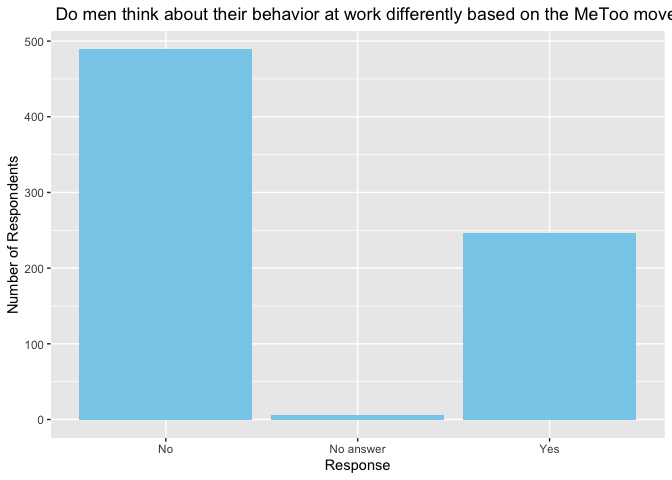
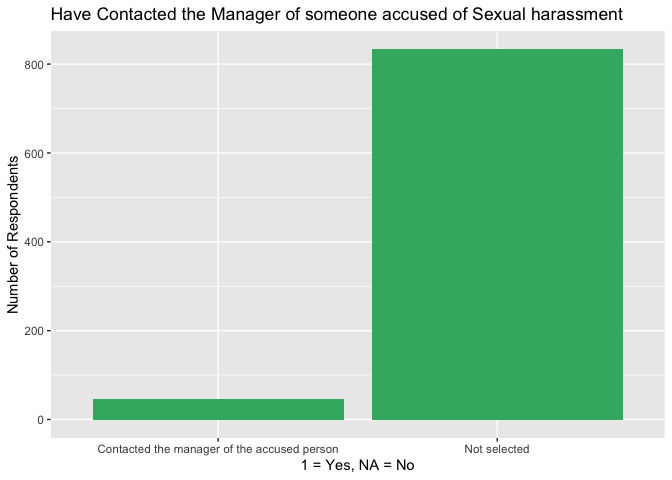
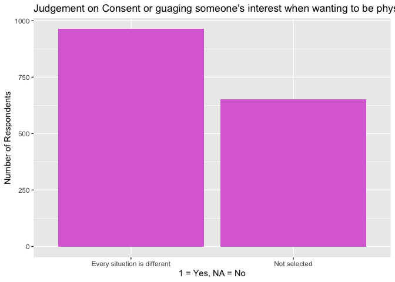
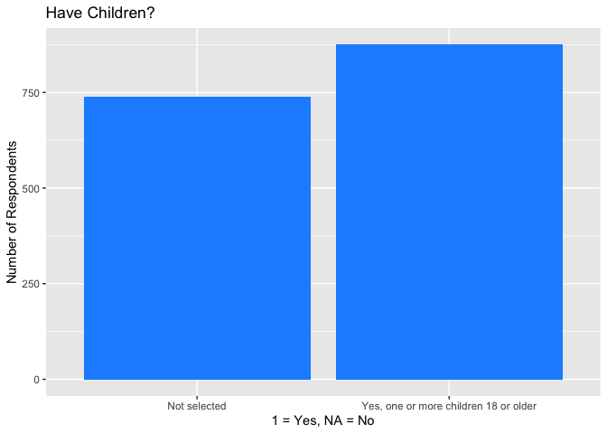
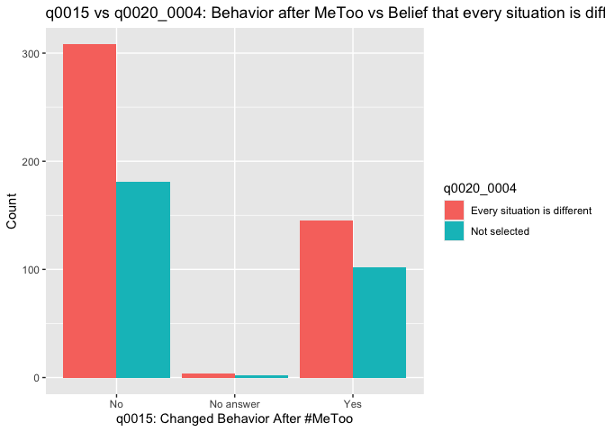
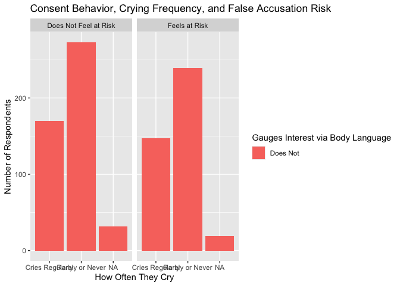

# Project 2
Sanjana Sasmal

## Research Question

What emotional and social beliefs are common among men when it comes to
masculinity, workplace expectations, relationships, and consent?

### Objective

This is a descriptive analysis to explore key beliefs and behaviors
related to masculinity — including emotional expression, pressures to
provide or stay strong, and how men gauge romantic interest or perceive
false accusations.

Subgroup comparisons (like men who feel “at greater risk of being
falsely accused”) will be explored in Project 3.

------------------------------------------------------------------------

## Description of the Data

The data comes from FiveThirtyEight’s 2018 survey *“What It Means to Be
a Man”*, which asked U.S. men about masculinity, relationships,
workplace culture, emotions, and societal pressures. The full dataset
contains responses to dozens of questions.

We analyze key questions related to:

-   Emotional isolation
-   Pressure to be a provider
-   Perceptions of consent
-   Attitudes about false accusations

------------------------------------------------------------------------

## Load and Prepare Data

``` r
library(tidyverse)
```

    ── Attaching core tidyverse packages ──────────────────────── tidyverse 2.0.0 ──
    ✔ dplyr     1.1.4     ✔ readr     2.1.5
    ✔ forcats   1.0.0     ✔ stringr   1.5.1
    ✔ ggplot2   3.5.2     ✔ tibble    3.2.1
    ✔ lubridate 1.9.4     ✔ tidyr     1.3.1
    ✔ purrr     1.0.4     
    ── Conflicts ────────────────────────────────────────── tidyverse_conflicts() ──
    ✖ dplyr::filter() masks stats::filter()
    ✖ dplyr::lag()    masks stats::lag()
    ℹ Use the conflicted package (<http://conflicted.r-lib.org/>) to force all conflicts to become errors

``` r
# Load full dataset
data <- read_csv("masculinity.csv")
```

    Rows: 1615 Columns: 60
    ── Column specification ────────────────────────────────────────────────────────
    Delimiter: ","
    chr (59): q0007_0001, q0007_0002, q0007_0003, q0007_0004, q0007_0005, q0007_...
    dbl  (1): X

    ℹ Use `spec()` to retrieve the full column specification for this data.
    ℹ Specify the column types or set `show_col_types = FALSE` to quiet this message.

------------------------------------------------------------------------

## Exploratory Data Analysis

### Do men think about their behavior at work differently based on #MeToo movement? (`q0015`)

``` r
data %>%
  filter(!is.na(q0015)) %>%
  count(q0015) %>%
  ggplot(aes(x = q0015, y = n)) +
  geom_bar(stat = "identity", fill = "skyblue") +
  labs(title = " Do men think about their behavior at work differently based on the MeToo movement?",
       x = "Response", y = "Number of Respondents")
```



## Most men say they did not change their behavior at work based on the meToo movement

### Men who have confronted someone who was accused of sexual harassment (`q0012_0001`)

``` r
data %>%
  filter(!is.na(q0012_0001)) %>%
  ggplot(aes(x = factor(q0012_0001))) +
  geom_bar(fill = "coral") +
  labs(title = "Have confronted someone accused of sexual harassment",
       x = "1 = Yes, NA = No", y = "Number of Respondents")
```


Very few, less than 1/8 of the men have not confronted someone who was
accused of sexual harassment

------------------------------------------------------------------------

### Men who have contacted the manager of someone accused of sexual harassment (`q0012_0003`)

``` r
data %>%
  filter(!is.na(q0012_0003)) %>%
  ggplot(aes(x = factor(q0012_0003))) +
  geom_bar(fill = "mediumseagreen") +
  labs(title = "Have Contacted the Manager of someone accused of Sexual harassment",
       x = "1 = Yes, NA = No", y = "Number of Respondents")
```



Very few, less than 1/8 of the men have not confronted the manager of
someone who was accused of sexual harassment either

------------------------------------------------------------------------

### Men who think every situation is different when it comes to guaging someone’s interest when they want to be physicially intimate with them (`q0020_0004`)

``` r
data %>%
  filter(!is.na(q0020_0004)) %>%
  ggplot(aes(x = factor(q0020_0004))) +
  geom_bar(fill = "orchid") +
  labs(title = "Judgement on Consent or guaging someone's interest when wanting to be physically intimate",
       x = "1 = Yes, NA = No", y = "Number of Respondents")
```



Over half of the men said that every situation is different when it
comes to guaging mutual interest in physical intimacy.

------------------------------------------------------------------------

### Have children? (`q0025_0002`)

``` r
data %>%
  filter(!is.na(q0025_0002)) %>%
  ggplot(aes(x = factor(q0025_0002))) +
  geom_bar(fill = "dodgerblue") +
  labs(title = "Have Children?",
       x = "1 = Yes, NA = No", y = "Number of Respondents")
```



Over half of the respondents say they have one or more children 18 or
older.

------------------------------------------------------------------------

## Bivariate Analysis

### MeToo Behavior Change vs Consent Judgement (`q0015` × `q0020_0004`)

``` r
data %>%
  filter(!is.na(q0015), !is.na(q0020_0004)) %>%
  count(q0015, q0020_0004) %>%
  ggplot(aes(x = q0015, y = n, fill = factor(q0020_0004))) +
  geom_bar(stat = "identity", position = "dodge") +
  labs(title = "q0015 vs q0020_0004: Behavior after MeToo vs Belief that every situation is different when guaging interest in physical intimacy",
       x = "q0015: Changed Behavior After #MeToo",
       y = "Count", fill = "q0020_0004")
```



## Regardless of whether men changed their behavior after the MeToo movement, a majority in both groups believe that gauging interest depends on the situation. So contextual thinking around consent is a fairly common belief among men, even among those who did not take direct behavioral action.

## Overall, I have set up the data so I can take the data of the men who said they feel at a greater risk of being falsley accused, and find correlations with their other answers to other questions relavent to consent and sexual harassment.

``` r
library(stringr)

data %>%
  filter(!is.na(q0020_0001), !is.na(q0007_0004), !is.na(q0011_0002)) %>%
  mutate(
    reads_body_lang = ifelse(q0020_0001 == 1, "Reads Body Language", "Does Not"),
    cries_often = case_when(
      q0007_0004 %in% c("Often", "Sometimes") ~ "Cries Regularly",
      q0007_0004 %in% c("Rarely", "Never, but open to it", "Never, and not open to it") ~ "Rarely or Never",
      TRUE ~ NA_character_
    ),
    feels_at_risk = ifelse(str_detect(q0011_0002, "Greater risk"), "Feels at Risk", "Does Not Feel at Risk")
  ) %>%
  count(reads_body_lang, cries_often, feels_at_risk) %>%
  ggplot(aes(x = cries_often, y = n, fill = reads_body_lang)) +
  geom_bar(stat = "identity", position = "dodge") +
  facet_wrap(~feels_at_risk) +
  labs(
    title = "Consent Behavior, Crying Frequency, and False Accusation Risk",
    x = "How Often They Cry",
    y = "Number of Respondents",
    fill = "Gauges Interest via Body Language"
  )
```



## Among the men who answered questions about crying, consent, and feeling at risk of false accusations, most say they cry rarely or never whether they feel at risk or not. Something to point out is that this plot only shows men who don’t use body language to gauge consent. That might mean the guys who do use body language didn’t answer the crying or false accusation questions, so we’re not seeing the full picture.

