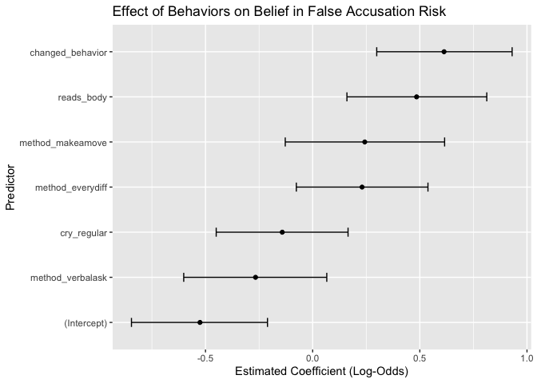

# Project3
Sanjana Sasmal

## Introduction and Data

The purpose of this project is to take a look at what are some beliefs
or behaviors linked to men who feel at greater risk of being accused of
sexual harassment. I’ll be using survey data from FiveThirtyEight’s 2018
masculinity study and try to build a model to predict this belief.

I focus only on that subgroup and look at their emotional behaviors and
views on consent.

``` r
library(tidyverse)
```

    ── Attaching core tidyverse packages ──────────────────────── tidyverse 2.0.0 ──
    ✔ dplyr     1.1.4     ✔ readr     2.1.5
    ✔ forcats   1.0.0     ✔ stringr   1.5.1
    ✔ ggplot2   3.5.2     ✔ tibble    3.2.1
    ✔ lubridate 1.9.4     ✔ tidyr     1.3.1
    ✔ purrr     1.0.4     
    ── Conflicts ────────────────────────────────────────── tidyverse_conflicts() ──
    ✖ dplyr::filter() masks stats::filter()
    ✖ dplyr::lag()    masks stats::lag()
    ℹ Use the conflicted package (<http://conflicted.r-lib.org/>) to force all conflicts to become errors

``` r
library(janitor)
```


    Attaching package: 'janitor'

    The following objects are masked from 'package:stats':

        chisq.test, fisher.test

``` r
library(tidyr)

raw <- read.csv("../Project1/data/raw.csv")

#binary variables
raw$Q11binary <- ifelse(raw$q0011_0002 == "Greater risk of being accused of sexual harassment", 1, 0)
raw$cry_regular <- ifelse(raw$q0007_0004 %in% c("Often", "Sometimes"), 1, 0)
raw$changed_behavior <- ifelse(raw$q0015 == "Yes", 1, 0)
raw$reads_body <- ifelse(raw$q0020_0001 == "Read their physical body language to see if they are interested", 1, 0)
raw$method_verbalask <- ifelse(raw$q0020_0002 == "Ask for a verbal confirmation of consent", 1, 0)
raw$method_makeamove <- ifelse(raw$q0020_0003 == "Make a physical move to see how they react", 1, 0)
raw$method_everydiff <- ifelse(raw$q0020_0004 == "Every situation is different", 1, 0)
raw$method_unclear <- ifelse(raw$q0020_0005 == "It isn’t always clear how to gauge someone’s interest", 1, 0)
raw$method_other <- ifelse(!is.na(raw$q0020_0006), 1, 0)

#logistic regression model
model <- glm(Q11binary ~ cry_regular + changed_behavior + reads_body +
               method_verbalask + method_makeamove + method_everydiff +
               method_unclear + method_other,
             data = raw, family = binomial)

summary(model)
```


    Call:
    glm(formula = Q11binary ~ cry_regular + changed_behavior + reads_body + 
        method_verbalask + method_makeamove + method_everydiff + 
        method_unclear + method_other, family = binomial, data = raw)

    Coefficients: (2 not defined because of singularities)
                     Estimate Std. Error z value Pr(>|z|)    
    (Intercept)       -0.5258     0.1617  -3.251 0.001150 ** 
    cry_regular       -0.1419     0.1568  -0.905 0.365462    
    changed_behavior   0.6131     0.1610   3.807 0.000141 ***
    reads_body         0.4850     0.1663   2.916 0.003549 ** 
    method_verbalask  -0.2665     0.1701  -1.567 0.117227    
    method_makeamove   0.2431     0.1895   1.283 0.199434    
    method_everydiff   0.2305     0.1566   1.472 0.140965    
    method_unclear         NA         NA      NA       NA    
    method_other           NA         NA      NA       NA    
    ---
    Signif. codes:  0 '***' 0.001 '**' 0.01 '*' 0.05 '.' 0.1 ' ' 1

    (Dispersion parameter for binomial family taken to be 1)

        Null deviance: 1028.50  on 741  degrees of freedom
    Residual deviance:  995.52  on 735  degrees of freedom
      (873 observations deleted due to missingness)
    AIC: 1009.5

    Number of Fisher Scoring iterations: 4

## Model Summary

Two predictors found:

-   Changed behavior: People who said “yes” to changing their behavior
    due to harassment were more likely to say men are at greater risk of
    being accused.
-   Reading body language: Those who rely on nonverbal cues to gauge
    interest also had higher chance of believing they are at risk.

These may reflect a sense of uncertainty and self-protection around
consent.

Several other behaviors did not show a strong effect, and some responses
were too sparse to analyze (causing `NA` results).

## Coefficient Plot

``` r
#Extract coefficients and confidence intervals
library(broom)
library(ggplot2)

coefs <- tidy(model, conf.int = TRUE) %>%
  filter(!is.na(estimate))

ggplot(coefs, aes(x = reorder(term, estimate), y = estimate)) +
  geom_point() +
  geom_errorbar(aes(ymin = conf.low, ymax = conf.high), width = 0.2) +
  coord_flip() +
  labs(
    title = "Effect of Behaviors on Belief in False Accusation Risk",
    x = "Predictor",
    y = "Estimated Coefficient (Log-Odds)"
  )
```


