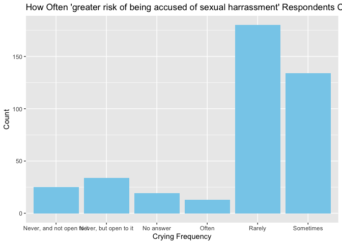
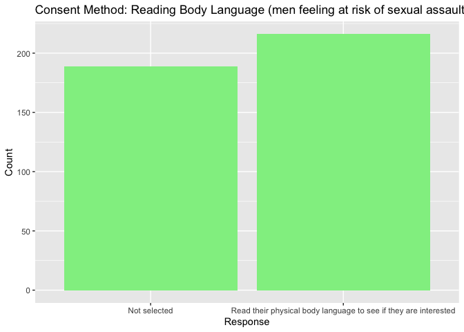
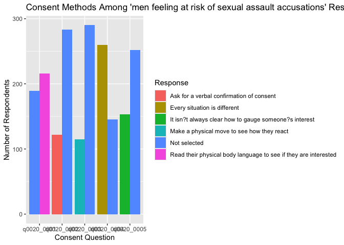
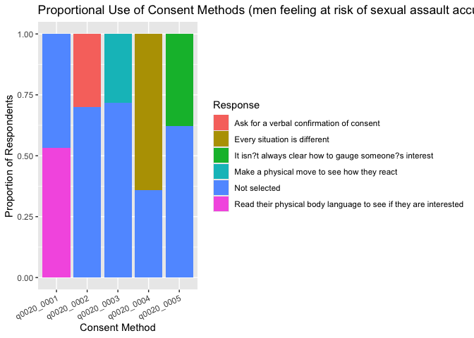
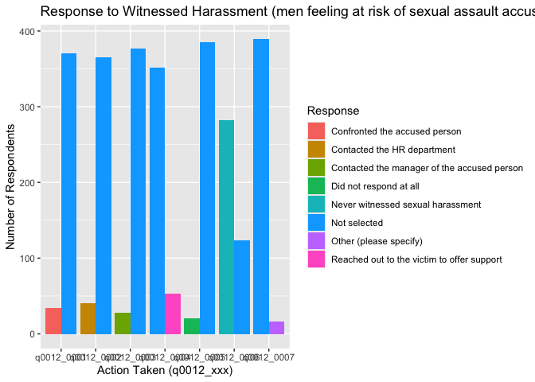

# Project3
Sanjana Sasmal

## Introduction and Data

The purpose of this project is to take a look at what are some beliefs
or behaviors linked to men who feel at greater risk of being accused of
sexual harassment. I’ll be using survey data from FiveThirtyEight’s 2018
masculinity study and try to build a model to predict this belief.

I focus only on that subgroup and look at their emotional behaviors and
views on consent.

``` r
library(tidyverse)
```

    ── Attaching core tidyverse packages ──────────────────────── tidyverse 2.0.0 ──
    ✔ dplyr     1.1.4     ✔ readr     2.1.5
    ✔ forcats   1.0.0     ✔ stringr   1.5.1
    ✔ ggplot2   3.5.2     ✔ tibble    3.2.1
    ✔ lubridate 1.9.4     ✔ tidyr     1.3.1
    ✔ purrr     1.0.4     
    ── Conflicts ────────────────────────────────────────── tidyverse_conflicts() ──
    ✖ dplyr::filter() masks stats::filter()
    ✖ dplyr::lag()    masks stats::lag()
    ℹ Use the conflicted package (<http://conflicted.r-lib.org/>) to force all conflicts to become errors

``` r
library(janitor)
```


    Attaching package: 'janitor'

    The following objects are masked from 'package:stats':

        chisq.test, fisher.test

``` r
library(tidyr)

data <- read_csv("data/masculinity.csv") %>%
  clean_names()
```

    Rows: 1615 Columns: 60
    ── Column specification ────────────────────────────────────────────────────────
    Delimiter: ","
    chr (59): q0007_0001, q0007_0002, q0007_0003, q0007_0004, q0007_0005, q0007_...
    dbl  (1): X

    ℹ Use `spec()` to retrieve the full column specification for this data.
    ℹ Specify the column types or set `show_col_types = FALSE` to quiet this message.

``` r
# Filtering to get the "greater risk of being accused" men
at_risk_data <- data %>%
  filter(q0011_0002 == "Greater risk of being accused of sexual harassment")
  
at_risk_data %>%
  filter(!is.na(q0007_0004)) %>%
  ggplot(aes(x = q0007_0004)) +
  geom_bar(fill = "skyblue") +
  labs(
    title = "How Often 'greater risk of being accused of sexual harrassment' Respondents Cry",
    x = "Crying Frequency",
    y = "Count"
  )
```



``` r
at_risk_data %>%
  filter(!is.na(q0020_0001)) %>%
  ggplot(aes(x = q0020_0001)) +
  geom_bar(fill = "lightgreen") +
  labs(
    title = "Consent Method: Reading Body Language (men feeling at risk of sexual assault accusations)",
    x = "Response",
    y = "Count"
  )
```



``` r
consent_long <- at_risk_data %>%
  select(q0020_0001:q0020_0005) %>%
  pivot_longer(cols = everything(), names_to = "question", values_to = "response") %>%
  filter(!is.na(response))

ggplot(consent_long, aes(x = question, fill = response)) +
  geom_bar(position = "dodge") +
  labs(
    title = "Consent Methods Among 'men feeling at risk of sexual assault accusations' Respondents",
    x = "Consent Question",
    y = "Number of Respondents",
    fill = "Response"
  )
```



``` r
## Consent Method Comparison (except in proportional view)
at_risk_data <- data %>%
  filter(q0011_0002 == "Greater risk of being accused of sexual harassment")

# Pivoting all 5 consent questions to long format
consent_long_all <- at_risk_data %>%
  select(q0020_0001:q0020_0005) %>%
  pivot_longer(cols = everything(), names_to = "method", values_to = "response") %>%
  filter(!is.na(response))
  
# Plotting proportional responses by method:::
ggplot(consent_long_all, aes(x = method, fill = response)) +
  geom_bar(position = "fill") +
  labs(
    title = "Proportional Use of Consent Methods (men feeling at risk of sexual assault accusations)",
    x = "Consent Method",
    y = "Proportion of Respondents",
    fill = "Response"
  ) +
  theme(axis.text.x = element_text(angle = 25, hjust = 1))
```



``` r
## Response to Witnessed Harassment (men feeling at risk of sexual assault accusations)

# Select harassment-related questions
harassment_responses <- at_risk_data %>%
  select(q0012_0001:q0012_0007)

# Pivot longer and filter out missing
harassment_long <- harassment_responses %>%
  pivot_longer(cols = everything(), names_to = "question", values_to = "response") %>%
  filter(!is.na(response))

# Plot the responses
ggplot(harassment_long, aes(x = question, fill = response)) +
  geom_bar(position = "dodge") +
  labs(
    title = "Response to Witnessed Harassment (men feeling at risk of sexual assault accusations)",
    x = "Action Taken (q0012_xxx)",
    y = "Number of Respondents",
    fill = "Response"
  )
```



## Interpretation:

The “Proportional Use of Consent Methods (men feeling at risk of sexual
assault accusations)” plot focuses on how men who believe they are at
greater risk of being accused of sexual harassment responded to a series
of questions about how they typically gauge another person’s interest in
physical intimacy. These questions (q0020_0001 to q0020_0005) include
different approaches to assessing consent, such as reading body
language, asking for verbal confirmation, making a physical move to see
how someone reacts, and indicating that “every situation is different.”

Each group of bars corresponds to one of the five consent related
questions, and the different colors within each group show how often
respondents selected each type of response. For example, one response
might indicate agreement, another might indicate disagreement, and some
might show uncertainty or lack of clarity. By presenting the data this
way, we can see how commonly each consent method is used among this
specific subgroup of men who feel especially vulnerable to accusations.

From the graph, we can see specific patterns in their behavior. Since a
large number of respondents said they read body language to determine
consent, it may suggest that this method is widely relied on, even among
those who feel at risk. Since relatively few respondents said they ask
for verbal confirmation, that might highlight a potential disconnect
between feeling at risk and using more explicit or cautious consent
strategies.

This analysis can give us insight into whether the men who believe they
are at greater risk of being accused are actually engaging in behaviors
that could reduce that risk. Alternatively, it may show that some
continue to rely on more ambiguous consent methods, even though they
feel vulnerable. This opens up further questions about awareness,
education, and personal beliefs about responsibility in intimate
situations.

------------------------------------------------------------------------
